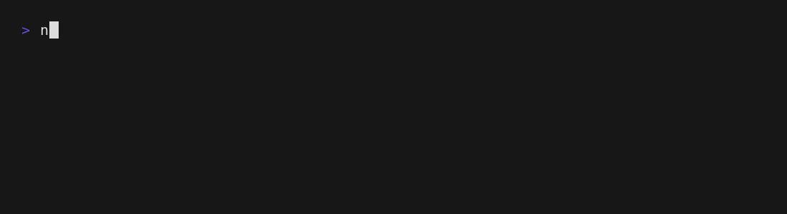

# agent-distro

**Your team's coding agents, in one command.** Package your skills, MCP servers,
and model gateway once, and run them in Oh My Pi, Codex, and Claude Code.

```sh
nix run github:juspay/agent-distro
```



- **Nothing to install.** Nix fetches the agent you pick; arguments after `--`
  go straight to it.
- **Always current.** Harnesses are updated daily, and an update lands only
  after the Linux/macOS builds and the NixOS VM tests pass.
- **Write once.** One [Agent Plugins](https://agent-plugins.org) directory works
  in all three harnesses; the per-harness translation is done for you.
- **Composes with your setup.** Your own plugins, settings, credentials, and
  sessions stay in place.
- **Make it yours.** `nix flake init -t github:juspay/agent-distro` starts a
  distribution with your plugins and, optionally, your LiteLLM gateway.

## Quick start

```sh
nix run github:juspay/agent-distro                     # pick from the list
AI_HARNESS=claude nix run github:juspay/agent-distro   # skip the list
nix profile install github:juspay/agent-distro         # keep it, as `ai`
```

The list shows every profile's harnesses, the default profile's rows first:

```
❯ vanilla  Oh My Pi
  vanilla  Codex
  vanilla  Claude Code
  juspay   Oh My Pi
  juspay   Codex
  juspay   Claude Code
```

| Variable | Values | Effect |
| --- | --- | --- |
| `AI_HARNESS` | `omp`, `codex`, `claude` | Launches that harness without the list; required in scripts and non-interactive shells |
| `AI_PROFILE` | a directory under `profiles/` | Chooses the profile, defaulting to the one `registry.nix` names; on its own, narrows the list to that profile |
| `AI_GATEWAY` | `0` | Keeps the plugins but skips gateway initialization |

Narrowed to one profile, the list needs no profile column and gets the
profile's description as a header:

```
Juspay skills + Kolu, via Juspay's LiteLLM gateway

❯ Oh My Pi
  Codex
  Claude Code
```

Escape or ctrl-c leaves the list.

Supported systems: `x86_64-linux`, `aarch64-linux`, and `aarch64-darwin`.

This flake names a binary cache in its `nixConfig`. Pass `--accept-flake-config`
to use it; without it, Oh My Pi is built from source.

## Build your own distribution

```sh
mkdir my-distribution && cd my-distribution
nix flake init -t github:juspay/agent-distro
```

Point `my-skills` at your Agent Plugins repository and edit `profile.nix`:

| Field | Meaning |
| --- | --- |
| `name` | Distribution identifier; Codex marketplace is `<name>-ai` |
| `description` | Header above the picker's list |
| `plugins` | List of directories containing `plugin.json` and `skills/<name>/SKILL.md`, optionally `mcp.json` |
| `gateway` | `null`, or `{ url; keyEnv; models = { large; small; }; keyHint; }` for a LiteLLM proxy |
| `packages` | Optional `pkgs: [ … ]`: commands the plugins' MCP servers name, put first on `PATH` for every harness |

An MCP server that a plugin declares by bare command, such as
`"command": "mcp-nixos"`, is found on `PATH`. List its package in `packages`
and it is built, or fetched from a binary cache, together with the launcher, so
the server starts at once instead of being downloaded when the agent first
asks for it, and every user runs the version the build pinned.

The template includes a gateway example; `agent-distro.profiles.vanilla` is the
reference profile shape. Commit `flake.lock` to pin your build. Your team then
runs `nix run github:<you>/my-distribution`, and updates with
`nix flake update agent-distro`.

```nix
agent-distro.lib.mkFlake { profile; systems ? [ "x86_64-linux" "aarch64-linux" "aarch64-darwin" ]; }
# → packages.<system>.{default,omp,codex,claude} and matching apps

agent-distro.lib.mkLaunchers { pkgs; profile; }
# → { omp; codex; claude; picker; }
```

A single-profile distribution draws the narrowed list above — one profile's
rows under its description; `mkFlake` still gives you the four packages, with
the picker as its `default`.

`mkFlake` returns only `packages` and `apps`; add other outputs with `//`.
For NixOS, with your distribution bound as `distro`:

```nix
environment.systemPackages = with distro.packages.${system}; [ omp codex claude ];
```

`AI_GATEWAY=0 nix run .#omp` skips gateway initialization while keeping plugins.
It preserves existing settings: choose personal models in OMP if you previously
used gateway defaults. Codex and Claude Code always use their own login.

## Profiles in this repository

| Profile | What it is |
| --- | --- |
| `vanilla` (default) | Upstream harnesses with your own provider; no plugins, no gateway |
| `juspay` | Juspay skills + Kolu, via Juspay's LiteLLM gateway |

<details>
<summary>Using the Juspay profile</summary>

```sh
AI_PROFILE=juspay nix run github:juspay/agent-distro
AI_PROFILE=juspay AI_HARNESS=omp nix run github:juspay/agent-distro -- --version
```

`AI_PROFILE=juspay` adds Juspay's skills and Kolu, and runs OMP against
Juspay's LiteLLM gateway, prompting for `LITELLM_API_KEY` unless it is
exported; create a key at
[grid.ai.juspay.net/dashboard](https://grid.ai.juspay.net/dashboard) (Juspay VPN
required). `AI_GATEWAY=0` keeps the plugins but skips gateway initialization.
Codex and Claude Code always use their own login. Kolu's MCP server needs `kolu`
on `PATH`. The profile supplies `mcp-nixos` itself, at its latest release.

</details>

A profile is a directory under `profiles/`:

```
profiles/
  registry.nix          # { default = "<name>"; } — the profile the list opens on
  <name>/profile.nix    # { name; description; plugins; gateway; packages; }
  <name>/npins/         # optional: the profile's pinned plugin and package sources
```

Profiles are discovered from the directory listing, so adding one is adding a
directory — nothing in `flake.nix` names them. `profile.nix` is a plain attrset
— `packages` is its one function, since only the builder has a package set —
whose `name` must match its directory, and it pins its own sources with
[npins](https://github.com/andir/npins):

```nix
let sources = import ./npins;
in { name = "example"; plugins = [ sources.skills ]; /* … */ }
```

npins rather than flake inputs, because the top-level `flake.lock` is inherited
by everyone who builds on `lib.mkFlake`, and no distribution's plugins belong
there. Add a source with
`npins --directory profiles/<name>/npins add github <owner> <repo>`, which
follows the repository's releases, or with `--branch main` to follow a branch.
The daily update advances every profile's pins alongside the harnesses: a
release pin to the latest release, a branch pin to its head.

## How it works

A **profile** is harness-independent data. A **harness** is the agent application.
A **plugin** is a portable Agent Plugins directory. A **gateway** is an optional
LiteLLM proxy used only by OMP.

- **OMP:** passes plugins as `-e` roots, composing with user extensions. A gateway
  prompts for its key, sets the LiteLLM environment, and fills absent model roles
  in user YAML while preserving existing values and comments.
- **Codex:** registers a store-built marketplace and installs plugins when its
  store path changes. Steady launches preserve disabled/removed plugins; a new
  build reinstalls them. Unrelated settings, credentials, and sessions persist.
  Vanilla skips registration entirely.
- **Claude Code:** translates manifests and copies skills/MCP configuration into
  self-contained plugin roots, passed with `--plugin-dir` for that session.
  Extra user plugins compose with them; no persistent installation is needed.

Plugin MCP commands are found on `PATH`: the profile's `packages` first, then
the user's own.

Profiles share each harness's own home directory, so what OMP and Codex persist
outlives the profile that wrote it: a Codex marketplace registered by one
profile is still registered when you launch `vanilla`, and so are the model
roles a gateway filled into OMP's config. Claude Code's plugins last only for
the session.

## Development

```sh
nix build .#default    # the picker, and through it every profile's launchers
nix flake check
just test              # offline NixOS VM tests; Linux with KVM
just test-template
just demo              # re-record doc/demo.gif
python3 .github/scripts/test-update-flake.py
```

Daily CI advances OMP's release tag, updates the root lock, advances every
`profiles/*/npins`, then updates `test/flake.lock` against this checkout. It
opens a dependency pull request naming the harness versions and the profile
pins that moved, approves the runs GitHub holds back for
automation-created pull requests, and squash-merges once the Linux/macOS builds
and the VM and template checks pass — the same checks `Require CI on main`
requires. Consumers update with `nix flake update agent-distro`.

For manual updates, advance `oh-my-pi.url` first, run `nix flake update`, then
`npins --directory profiles/<name>/npins update` per profile, then
`bash test/update-lock.sh`.

Consumers can import `test/lib.nix { pkgs; launchers; profile; }` and select
`omp`, `codex`, `claude`, and `picker`. Gateway tests (`gateway`, `gatewayEnv`)
and plugin rebuild tests (`ompPlugins`, `codexPlugins`, `claudePlugins`) are
separate attributes; rebuild tests additionally take `mkLaunchers`. Select
plugin rebuild tests only for nonempty skill plugins. `test/flake.nix` runs
every applicable attribute against every profile in `profiles/`, plus `registry`
— the same `picker` check over the whole registry.
